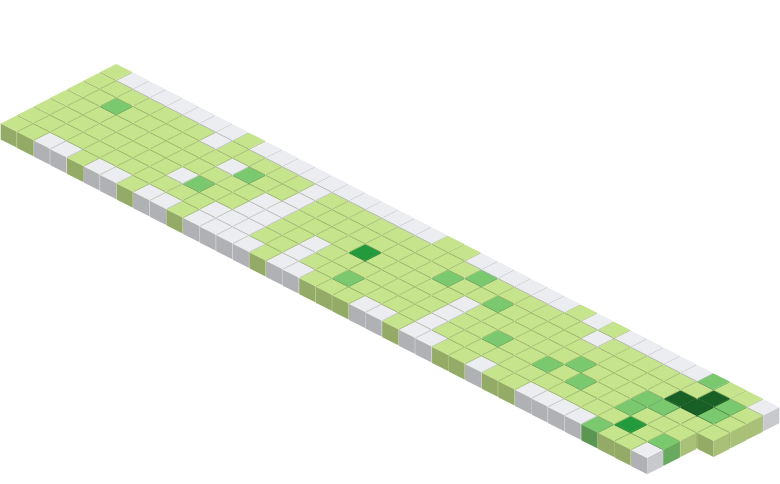

<div align="center">

<a href="https://github.com/jasurhaydarovcode">

</a>

</div>

```html
Hey, HTML homies, what’s up?
```

---

<!-- <details>
<summary>🍪 SKILLS:</summary>


</details> -->

---

<!-- =================================================== Projects =================================================== -->
<details>
    <summary>📂 Projects:</summary>

# Projects

| Project 1                                                                                                                                                                                          | Project 2                                                                                                                                                                      |
| -------------------------------------------------------------------------------------------------------------------------------------------------------------------------------------------------- | ------------------------------------------------------------------------------------------------------------------------------------------------------------------------------ |
| [](https://github.com/jasurhaydarovcode/GEADEZIST) | [](https://github.com/jasurhaydarovcode/football-stadium-dashboard) |

<!-- | Project 3                                                                                                                                                                        | Project 4                                                                                                                                                                      |
| -------------------------------------------------------------------------------------------------------------------------------------------------------------------------------- | ------------------------------------------------------------------------------------------------------------------------------------------------------------------------------ |
| [](https://github.com/jasurhaydarovcode/olcha.uz) | [](https://github.com/jasurhaydarovcode/Zlatmax) | -->

</details>

<details>
    <summary>🗽 Skills:</summary>

# Skills

<div align="center">

[]()

### Favorite Package Managers
[]()

</div>

</details>

<a href="https://github.com/jasurhaydarovcode">

</a>